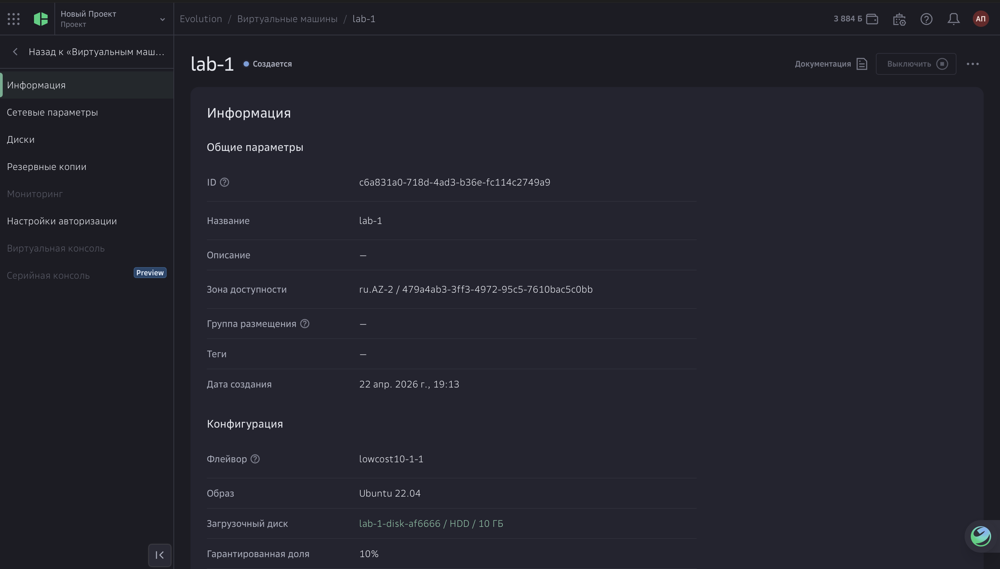
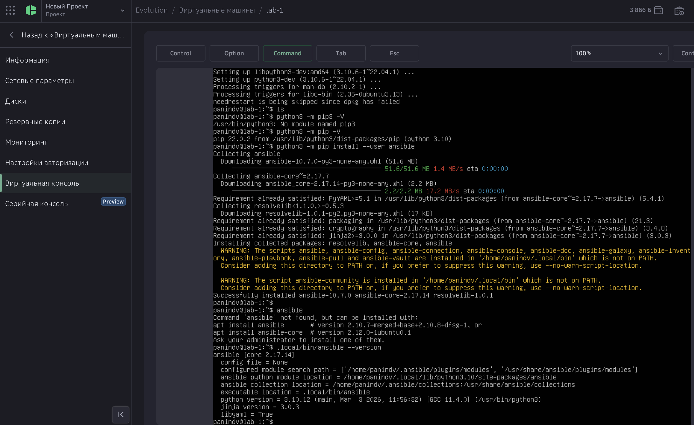
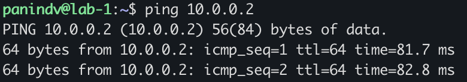
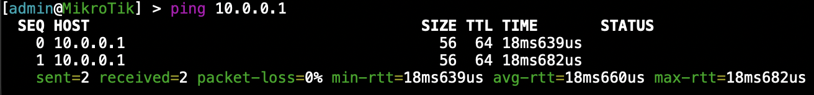

University: [ITMO University](https://itmo.ru/ru/)

Faculty: [FICT](https://fict.itmo.ru)

Course: [Network programming](https://github.com/itmo-ict-faculty/network-programming)

Year: 2025/2026

Group: K3320

Author: Panin Dmitriy Vladimirovich

Lab: Lab1

Date of create: 22.04.2026

Date of finished: 22.04.2026

# Лабораторная работа №1

## Задание

<https://itmo-ict-faculty.github.io/network-programming/education/labs2023_2024/lab1/lab1/>


### VM





### VPN-сервер

Установка пакетов:

```bash
sudo apt update
sudo apt install wireguard
sudo apt install iptables-persistent
```

Настройка FireWall:

```bash
sudo iptables -I INPUT -p udp --dport 51820 -j ACCEPT
sudo netfilter-persistent save
```

Генерация ключей:

```bash
wg genkey | tee server_private.key | wg pubkey > server_public.key
wg genkey | tee client_private.key | wg pubkey > client_public.key
```

Настройка /etc/wireguard/wg0.conf

```conf
[Interface]
Address = 10.0.0.1/24
ListenPort = 51820
PrivateKey = <SERVER_PRIVATE_KEY>

PostUp = iptables -A FORWARD -i wg0 -j ACCEPT; iptables -A FORWARD -o wg0 -j ACCEPT; iptables -t nat -A POSTROUTING -o eth0 -j MASQUERADE
PostDown = iptables -D FORWARD -i wg0 -j ACCEPT; iptables -D FORWARD -o wg0 -j ACCEPT; iptables -t nat -D POSTROUTING -o eth0 -j MASQUERAD

[Peer]
PublicKey = <CLIENT_PRIVATE_KEY>
AllowedIPs = 10.0.0.2/32
```

Запуск сервера:

```bash
sudo systemctl start wg-quick@wg0
sudo systemctl enable wg-quick@wg0
sudo wg
interface: wg0
  public key: dSQvwLS5eFlOcwkgi+KSFbzJ/S3Dqd3psZAc84LYZHU=
  private key: (hidden)
  listening port: 51820

peer: 44Y6pS8XLDzvYOOxFjCFrEiFu6HArwvDk8raxYS1ARs=
  endpoint: 45.135.165.126:46439
  allowed ips: 10.0.0.2/32
```

### VPN-клиент

```routeros
/interface wireguard add name=wg0 private-key="<CLIENT_PRIVATE_KEY>"
/ip address add address=10.0.0.2/24 interface=wg0

/interface wireguard peers add \
    interface=wg0 \
    public-key="<SERVER_PUBLIC_KEY>" \
    endpoint-address=<SERVER_IP> \
    endpoint-port=51820 \
    allowed-address=0.0.0.0/0 \
    persistent-keepalive=25

/ip firewall nat add chain=srcnat out-interface=wg0 action=masquerade
```

### Тест

Ping с сервера на роутер:



Ping с роутера на сервер:



## Заключение

В результате выполнения лабораторной работы была проведена установка CHR и Ansible, настройка VPN Wireguard.
