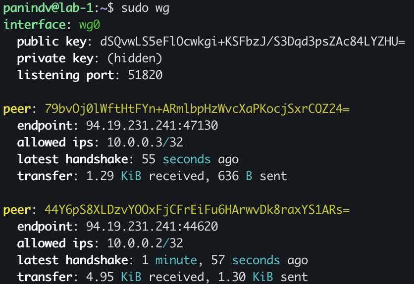
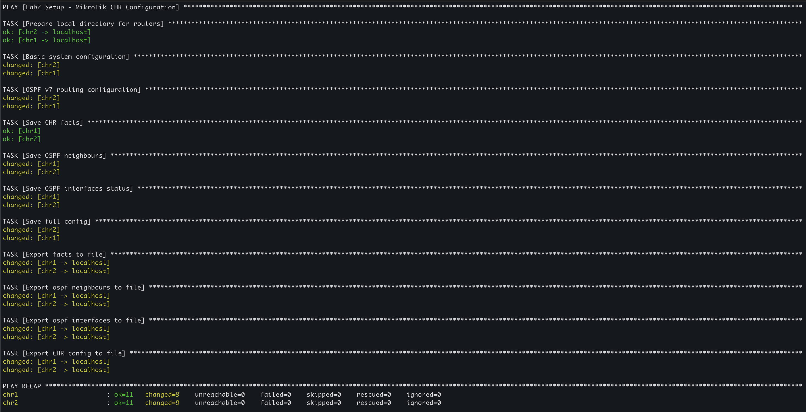

University: [ITMO University](https://itmo.ru/ru/)

Faculty: [FICT](https://fict.itmo.ru)

Course: [Network programming](https://github.com/itmo-ict-faculty/network-programming)

Year: 2025/2026

Group: K3320

Author: Panin Dmitriy Vladimirovich

Lab: Lab2

Date of create: 23.04.2026

Date of finished: 23.04.2026

# Лабораторная работа №1

## Задание

<https://itmo-ict-faculty.github.io/network-programming/education/labs2023_2024/lab2/lab2/>


### VPN-сервер

Генерация ключей:

```bash
wg genkey | tee client2_private.key | wg pubkey > client2_public.key
```

Добавляем в /etc/wireguard/wg0.conf

```conf
[Peer]
PublicKey = <CLIENT_PRIVATE_KEY>
AllowedIPs = 10.0.0.3/32
```

Рестартим сервис:

```bash
sudo systemctl restart wg-quick@wg0.service
sudo wg
interface: wg0
  public key: dSQvwLS5eFlOcwkgi+KSFbzJ/S3Dqd3psZAc84LYZHU=
  private key: (hidden)
  listening port: 51820

peer: 44Y6pS8XLDzvYOOxFjCFrEiFu6HArwvDk8raxYS1ARs=
  endpoint: 94.19.231.241:44620
  allowed ips: 10.0.0.2/32

peer: 79bvOj0lWftHtFYn+ARmlbpHzWvcXaPKocjSxrCOZ24=
  allowed ips: 10.0.0.3/32
```

### VPN-клиент

```routeros
/interface wireguard add name=wg0 private-key="<CLIENT_PRIVATE_KEY>"
/ip address add address=10.0.0.3/24 interface=wg0

/interface wireguard peers add \
    interface=wg0 \
    public-key="<SERVER_PUBLIC_KEY>" \
    endpoint-address=<SERVER_IP> \
    endpoint-port=51820 \
    allowed-address=0.0.0.0/0 \
    persistent-keepalive=25

/ip firewall nat add chain=srcnat out-interface=wg0 action=masquerade
```

### Тест



### Ansible

Запуск [плейбука](ansible/playbook.yml):



Результат в папке [routers](routers/)

## Заключение

В ходе работы был создан второй роутер, на котором по аналогии с первым были выполнены все настройки. Затем была проведена настройка Ansible с созданием файлов хостов, переменных. После были написаны сценарии для 1 добавления нового пользователя и изменения пароля у роутера; 2 настройки NTP-клиента; 3 настройки OSPF на роутерах; 4 экспорта настроек роутеров в файлы на сервере. Цель работы достигнута.
